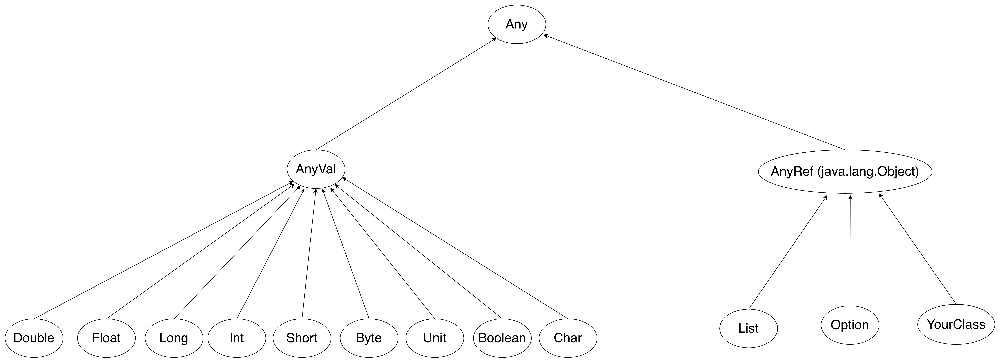

# Classes and Traits

We'll cover:
* Class syntax
* Visibility modifiers
* Class heritage and relationships
* Objects and traits
* Abstract classes
* Case classes
* Object classes
* Pattern matching

---


## Classes

<!--omit-from-slides start-->
* A representation of elements of the same kind from the real world.
* A template for the creation of object instances.
<!--omit-from-slides end-->

```scala mdoc:silent:reset 
class Robot(name: String)

val tom = new Robot("Tom")

// tom.name  --> compiler error: value name cannot be accessed as a member of Robot
```

---

### val
<!--omit-from-slides start-->
Values are immutable. Scala generates the getter method.
<!--omit-from-slides end-->


```scala mdoc:silent:reset 
class Robot(val name: String) // The name is declared as an immutable value

val robot = new Robot("Tom")

robot.name 

// robot.name = "John" --> compiler error: Reassignment to val
```

---

### var
<!--omit-from-slides start-->
Variables are mutable. Scala generates a getter and a setter.
<!--omit-from-slides end-->


```scala mdoc:silent:reset 
class Robot(var name: String) // Name is mutable

val robot = new Robot("Tom")

robot.name = "John"
robot.name // returns "John"
```

---

### Visibility of constructor fields

* var: getter and setter
* val: getter
* default (no var or val): I cannot access or mutate the field 

---

### Methods and private keyword

```scala mdoc:silent:reset 
class Animal {
  private def breathe() = println("I’m breathing")

  def walk() = {
    breathe()
    println("I’m walking")
  }
  
  def speak() = println("Hello")
}

val animal = new Animal()
animal.speak()
animal.walk()
// animal.breathe() // won't compile

```

---

### Initalisation of class body

<!--omit-from-slides start-->
In Scala, classes have methods and additional fields defined in the body of the class. The body is initialised as part of the default constructor.
<!--omit-from-slides end-->

```scala mdoc:silent:reset 
class Person(firstName: String, lastName: String) {
  println("Constructor begins")

  // some class fields
  private val fullName = s"$firstName $lastName"
  val city = "London"

  //some methods
  def printCity(): Unit = {
    println(city)
  }

  def printFullName(): Unit = {
    println(fullName)
  }

  printFullName()
  printCity()
  println("Still in the constructor")
}
```

---

### No parameters class

```scala mdoc:silent:reset 
class Robot {
  val name = "Tom"
  val age = 12
} 

val robot = new Robot()
robot.name // Tom
robot.age // 12
```

---

### Named parameters

<!--omit-from-slides start-->
When more than one class parameters have the same type, you should use named parameters to improve readability and avoid ambiguity.
<!--omit-from-slides end-->

```scala mdoc:silent:reset 
class Coordinate(latitude: Double, longitude: Double)

new Coordinate(42.42, 24.24)
new Coordinate(latitude = 42.42, longitude = 24.24)
new Coordinate(longitude = 24.24, latitude = 42.42)
```

---

### Default parameter values

<!--omit-from-slides start-->
A parameter can have a default value in the constructor declaration.
<!--omit-from-slides end-->

```scala mdoc:silent:reset 
class Socket(val timeout: Int = 10000)

val s1 = new Socket()
s1.timeout // 10000

val s2 = new Socket(5000)
s2.timeout // 5000
```

---

<!--omit-from-slides start-->
Consumers of this code can create classes as though the class had alternate constructors.
<!--omit-from-slides end-->

```scala mdoc:silent:reset 
class Socket(timeout: Int = 5000, linger: Int = 5000) {
  override def toString = s"timeout: $timeout, linger: $linger"
}

val s1 = new Socket()                  // timeout: 5000, linger: 5000
val s2 = new Socket(2500)             // timeout: 2500, linger: 5000
val s3 = new Socket(10000, 10000)    // timeout: 10000, linger: 10000
val s4 = new Socket(timeout = 10000)  // timeout: 10000, linger: 5000
val s5 = new Socket(linger = 10000)   // timeout: 5000, linger: 10000
```

---

## Subclasses

<!--omit-from-slides start-->
An object class derived from another class (its superclass) from which it inherits a base set of properties and methods.
<!--omit-from-slides end-->

```scala mdoc:silent:reset
class Robot(val name: String = "Unknown") {
  def welcome(n: String) = s"Welcome $n! My name is $name"
}

class ItalianRobot(name: String) extends Robot {
  override def welcome(n: String) =
    s"Benvenuto $n! Il mio nome e' $name"
}

class EnglishRobot(name: String, country: String) extends Robot {
  override def welcome(n: String) =
    s"Welcome $n, I am $name from the country of $country!"
}


val will = new EnglishRobot("Will", "England")
will.welcome("Jane") 
// Welcome Jane, I am Will from the country of England!
```

---
## Class hierarchy

<!--omit-from-slides start-->
In Scala, all values have a type, including numerical values and functions. The diagram illustrates a subset of the type hierarchy.
<!--omit-from-slides end-->



https://docs.scala-lang.org/tour/unified-types.html

---

<!--omit-from-slides start-->
Here is an example that demonstrates that strings, integers, characters, boolean values,
and functions are all of type `Any` just like every other object:

Most of the time we want to be specific. In real life we hardly see `Any`.
<!--omit-from-slides end-->

```scala mdoc:silent:reset
val list: List[Any] = List(
  "a string",
  732,  // an integer
  'c',  // a character
  true, // a boolean value
  () => "an anonymous function returning a string"
)

list.foreach(element => println(element))

//a string 
//732
//c
//true
//$line6.$read$$iw$$Lambda/0x00003ff8021e2a80@3cf30bd5
```

---

## Pattern matching

<!--omit-from-slides start-->
* A mechanism for checking a value against a pattern. 
* A more powerful version of the switch statement 
* Can be used in place of a series of if/else statements.
* Compiler will warn you if you don't handle all cases
<!--omit-from-slides end-->

```scala mdoc:silent:reset
import scala.util.Random

val x: Int = Random.nextInt(10)

x match {
  case 0 => "zero"
  case 1 => "one"
  case 2 => "two"
  case _ => "other"
}
```

---

## Companion objects

<!--omit-from-slides start-->
A class that has exactly one instance. It’s initialized lazily when its members are referenced. 
The first time you request access to an object, the JVM allocates it in memory; 
following references to the same object do not trigger any new instantiation because the JVM reuses 
its first memory allocation, a model called singleton pattern. 
<!--omit-from-slides end-->


```scala mdoc:silent:reset
object StringUtils {
  def truncate(s: String, length: Int): String = s.take(length)
  def containsWhitespace(s: String): Boolean = s.matches(".*\\s.*")
  def isNullOrEmpty(s: String): Boolean = s == null || s.trim.isEmpty
}

StringUtils.truncate("Joe Smith", 5)  // Joe S
```
---

<!--omit-from-slides start-->
You can import all members of an object
<!--omit-from-slides end-->

```scala mdoc:silent
import StringUtils._
truncate("Chuck Bartowski", 5)       // "Chuck"
containsWhitespace("Sarah Walker")   // true
isNullOrEmpty("John Casey")          // false
```

<!--omit-from-slides start-->
or just some members:
<!--omit-from-slides end-->

```scala mdoc:silent
import StringUtils.{truncate, containsWhitespace}
truncate("Charles Carmichael", 7)       // "Charles"
containsWhitespace("Captain Awesome")   // true
isNullOrEmpty("Morgan Grimes")          // Not found: isNullOrEmpty (error)
```

---
<!--omit-from-slides start-->
Objects can also contain fields, which are also accessed like static members
<!--omit-from-slides end-->

```scala mdoc:silent:reset
object MathConstants {
  val PI = 3.14159
  val E = 2.71828
}

println(MathConstants.PI)   // 3.14159
```

---

## Companion objects

<!--omit-from-slides start-->
* An object that has the same name as a class, and is declared in the same file as the class.
* A companion class or object can access the private members of its companion.
* Used for methods and values that are not specific to instances of the companion class.
<!--omit-from-slides end-->

```scala mdoc:silent:reset
import scala.math._

class Circle(val radius: Double) {
  def area: Double = Circle.calculateArea(radius)
}

object Circle {
  private def calculateArea(radius: Double): Double = Pi * pow(radius, 2.0)
}

val circle1 = new Circle(5.0)
circle1.area
```
---

<!--omit-from-slides start-->
Companion objects contain: 

* apply methods, which work as factory methods to construct new instances
* unapply method deconstructs objects to its parameters
<!--omit-from-slides end-->

### apply and unapply method

```scala mdoc:silent:reset
class Person {
  var name = ""
  var age = 0
  override def toString = s"$name is $age years old"
}

object Person {
  // a one-arg factory method
  def apply(name: String): Person = {
    var p = new Person
    p.name = name
    p
  }

  // a two-arg factory method
  def apply(name: String, age: Int): Person = {
    var p = new Person
    p.name = name
    p.age = age
    p
  }

  def unapply(p: Person): Option[(String, Int)] = Some(p.name, p.age)
}

val p1 = Person("Joe")
val p2 = Person("Fred", 29)
```

---

### Pattern matching on objects and pattern guard

```scala mdoc:silent
Person.unapply(p2) // Option[(String, Int)] = Some((Fred,29))

val driverLicenseStatus = p2 match {
  case Person(_, age) if age < 18 => "You are not allowed to get a driver license."
  case Person(_, age) if age >= 18 => "You are allowed to get a driver's license."
}

val driverLicenseStatus2 = if (p2.age < 18) "You are not allowed to get a driver license." else "You are allowed to get a driver's license."


```

---

## Traits
<!--omit-from-slides start-->
Scala trait is similar to an interface in Java. Traits can contain:
* Abstract methods and fields
* Concrete methods and fields
<!--omit-from-slides end-->

```scala mdoc:silent:reset
trait Animal {
  def sleep = "ZzZ"
  def eat(food: String): String
  def move(x: Int, y: Int): String
}

trait Nameable {
  def name: String
}
```
---

<!--omit-from-slides start-->
* A class inherits from a trait using the keyword `extends`
* For more traits we use the keyword `with`
* The compiler will guarantee that your class respects its interfaces, or it will fail with an error message listing methods
and fields that you still need to implement.
<!--omit-from-slides end-->

```scala mdoc:silent
class Cat extends Animal {
  override val sleep = "sleepy cat!"
  def eat(food: String) = s"the cat is eating $food"
  def move(x: Int, y: Int) = s"the cat is moving to ($x,$y)"
}

class Dog(val name: String) extends Animal with Nameable {
  def eat(food: String) = s"$food $food"
  def move(x: Int, y: Int) = "let's go to ($x, $y)!"
}
```

---

### The entry point of a program

```scala mdoc:silent:reset
object HelloWorld extends App {
  println("Hello world!")
}
```

---

## Sealed traits

<!--omit-from-slides start-->
* Use a sealed trait to limit the elements that extend it.
* All the components that extend the trait are in the same file where the interface is declared.
* Compiler will warn you if you don't handle all the cases
<!--omit-from-slides end-->

```scala
sealed trait Suit
object Clubs extends Suit
object Diamonds extends Suit
object Hearts extends Suit
object Spades extends Suit

def getSuit(suit: Suit): String = suit match {
  case Clubs    => "Clubs"
  case Spades   => "Spades"
  case Diamonds => "Diamonds"
  case Hearts   => "Hearts"
}

println(getSuit(Hearts))   // Hearts
println(getSuit(Spades))   // Spades
```

---
## Abstract classes

<!--omit-from-slides start-->
When you want to write a class, but you know it will have abstract members, 
you can either create a trait or an abstract class. In most situations you’ll use traits, 
but historically there have been two situations where it’s better to use an abstract class than a trait:

* You want to create a base class that takes constructor arguments.
* The code will be called from Java code
<!--omit-from-slides end-->

```scala mdoc:silent:reset
abstract class Pet(name: String) {
  def greeting: String
  def age: Int
  override def toString = s"My name is $name, I say $greeting, and I’m $age"
}

class Dog(name: String, var age: Int) extends Pet(name) {
  val greeting = "Woof"
}

val d = new Dog("Fido", 1)
```

---

## Case classes
Case classes are used to model immutable data structures.

<!--omit-from-slides start-->
* An `apply` method is generated so you don't need to use the `new` keyword to create a new instance of the class.
* Case class constructor parameters are `val` by default.
* They have built in `equals` method so that case classes with the same data are considered equal.
* They have a default `unapply` method so you can pattern match.
* They have a default `toString` method.
* Since they are immutable they have a `copy` method  to easily create new instances
<!--omit-from-slides end-->

```scala mdoc:silent:reset
case class Person(name: String, relation: String)

val christina = Person("Christina", "niece")

//christina.name = "Fred"   // error: reassignment to val
println(christina) // Person(Christina,niece)
```
  
---

```scala mdoc:silent:reset
case class Message(sender: String, recipient: String, body: String)

val message2 = Message("joe.smith@gmail.com", "mary.smith@gmail.com", "Hello")
val message3 = Message("joe.smith@gmail.com", "mary.smith@gmail.com", "Hello")
val messagesAreTheSame = message2 == message3  // true

val message4 = Message("bob@gmail.com", "alice@gmail.com", "Hello")
val message5 = message4.copy(sender = message4.recipient, recipient = "claire@gmail.com")
message5.sender  // alice@gmail.com
message5.recipient // claire@gmail.com
message5.body  // Hello

println(message5) // Message(alice@gmail.com,claire@gmail.com,Hello)

```

---

## Case classes and pattern matching

```scala 
sealed trait Message
case class PlaySong(name: String) extends Message
case class IncreaseVolume(amount: Int) extends Message
case class DecreaseVolume(amount: Int) extends Message

def handleMessages(message: Message): Unit = message match {
  case PlaySong(name)         => playSong(name)
  case IncreaseVolume(amount) => changeVolume(amount)
  case DecreaseVolume(amount) => changeVolume(-amount)
}
```

---

## Case objects

Case objects are used to model singleton ideas, where the singleton itself is the data.

<!--omit-from-slides start-->
* No need for extra arguments so it also doesn’t need any `apply`, `copy` or `unapply` methods 
* No need for `equals` because singletons can only be defined once.
* They have an improved `toString` implementation
<!--omit-from-slides end-->

## Case objects and Pattern matching

```scala mdoc:reset
sealed trait Suit
case object Clubs extends Suit
case object Diamonds extends Suit
case object Hearts extends Suit
object Spades extends Suit

println(Clubs) 
println(Diamonds) 
println(Spades)

```

---

```scala 
sealed trait Message
case class PlaySong(name: String) extends Message
case class IncreaseVolume(amount: Int) extends Message
case class DecreaseVolume(amount: Int) extends Message
case object StopPlaying extends Message

def handleMessages(message: Message): Unit = message match {
  case PlaySong(name)         => playSong(name)
  case IncreaseVolume(amount) => changeVolume(amount)
  case DecreaseVolume(amount) => changeVolume(-amount)
  case StopPlaying            => stopPlayingSong()
}

```
---

```scala
sealed trait OptionalString 
case class SomeString(value: String) extends OptionalString
case object NoString extends OptionalString
```

## Homework
Think how would you model the data in the Election Results exercise: 
https://github.com/guardian/coding-exercises/tree/main/election-results